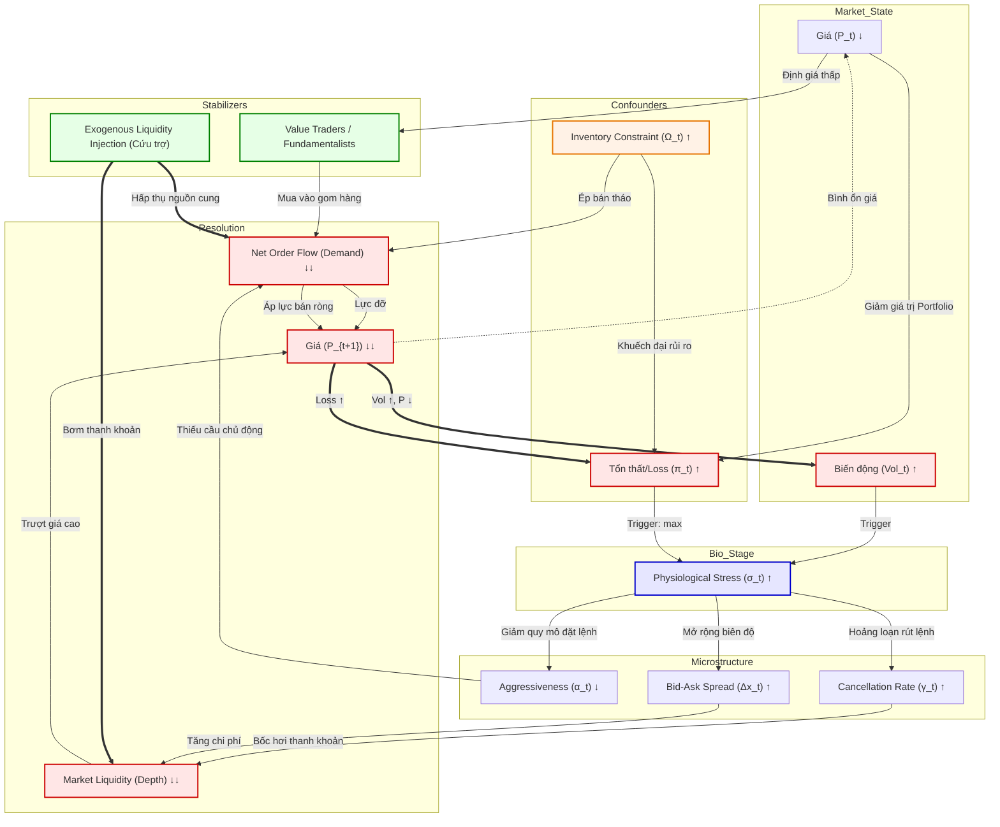

```mermaid
graph TD
    %% Khối 1: Trạng thái thị trường & Kích hoạt ban đầu
    subgraph Market_State
        P_t["Giá (P_t) ↓"]
        Vol_t["Biến động (Vol_t) ↑"]
    end

    %% Khối 2: Tác nhân Ổn định (Vòng lặp Âm)
    subgraph Stabilizers
        Value_T["Value Traders / Fundamentalists"]
        Exo_Liq["Exogenous Liquidity Injection (Cứu trợ)"]
    end

    %% Khối 3: Biến Nhiễu - Yếu tố Cơ học
    subgraph Confounders
        Inv_t["Inventory Constraint (Ω_t) ↑"]
        PnL_t["Tổn thất/Loss (π_t) ↑"]
    end

    %% Khối 4: Yếu tố Sinh lý - Nội sinh
    subgraph Bio_Stage
        Stress_t["Physiological Stress (σ_t) ↑"]
    end

    %% Khối 5: Hành vi Vi mô (Stage 2 ABM)
    subgraph Microstructure
        Alpha["Aggressiveness (α_t) ↓"]
        Gamma["Cancellation Rate (γ_t) ↑"]
        Spread["Bid-Ask Spread (Δx_t) ↑"]
    end

    %% Khối 6: Độ sâu Thị trường & Giá t+1
    subgraph Resolution
        Liq_t["Market Liquidity (Depth) ↓↓"]
        Net_D["Net Order Flow (Demand) ↓↓"]
        P_t1["Giá (P_{t+1}) ↓↓"]
    end

    %% --- ĐƯỜNG DẪN NHÂN QUẢ ---

    P_t -->|Định giá thấp| Value_T
    Value_T -->|Mua vào gom hàng| Net_D
    Net_D -->|Lực đỡ| P_t1
    P_t1 -.->|Bình ổn giá| P_t

    P_t -->|Giảm giá trị Portfolio| PnL_t
    Inv_t -->|Khuếch đại rủi ro| PnL_t
    Inv_t -->|Ép bán tháo| Net_D
    
    Vol_t -->|Trigger| Stress_t
    PnL_t -->|Trigger: max| Stress_t
    
    Stress_t -->|Giảm quy mô đặt lệnh| Alpha
    Stress_t -->|Hoảng loạn rút lệnh| Gamma
    Stress_t -->|Mở rộng biên độ| Spread

    Alpha -->|Thiếu cầu chủ động| Net_D
    Gamma -->|Bốc hơi thanh khoản| Liq_t
    Spread -->|Tăng chi phí| Liq_t
    
    Liq_t -->|Trượt giá cao| P_t1
    Net_D -->|Áp lực bán ròng| P_t1

    P_t1 == "Vol ↑, P ↓" ===> Vol_t
    P_t1 == "Loss ↑" ===> PnL_t

    Exo_Liq ==>|Bơm thanh khoản| Liq_t
    Exo_Liq ==>|Hấp thụ nguồn cung| Net_D

    %% Styling
    classDef crash fill:#ffe6e6,stroke:#cc0000,stroke-width:2px;
    classDef rescue fill:#e6ffe6,stroke:#008000,stroke-width:2px;
    classDef bio fill:#e6e6ff,stroke:#0000cc,stroke-width:2px;
    classDef confounder fill:#fff2e6,stroke:#e67300,stroke-width:2px;
    
    class P_t1,Vol_t,Liq_t,Net_D,PnL_t crash;
    class Value_T,Exo_Liq rescue;
    class Stress_t bio;
    class Inv_t confounder;
```