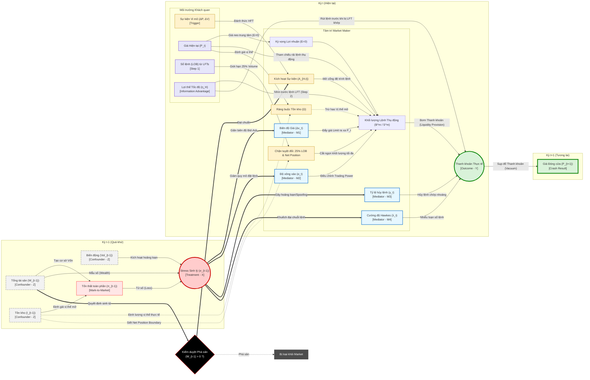

```mermaid
graph LR
    %% ==========================================
    %% THỜI ĐIỂM t-1 (QUÁ KHỨ)
    %% ==========================================
    subgraph Time_t_minus_1 ["Kỳ t-1 (Quá khứ)"]
        direction TB
        W_t1["Tổng tài sản (W_{t-1})<br/>[Confounder - Z]"]
        Inv_t1["Tồn kho (I_{t-1})<br/>[Confounder - Z]"]
        Vol_t1["Biến động (Vol_{t-1})<br/>[Confounder - Z]"]
        
        Pi_t1["Tổn thất toàn phần (π_{t-1})<br/>[Mark-to-Market]"]
        Stress_t1(("Stress Sinh lý (σ_{t-1})<br/>[Treatment - X]"))
        
        W_t1 -->|"Tạo cơ sở Vốn"| Pi_t1
        Inv_t1 -->|"Định giá vị thế mở"| Pi_t1
        Pi_t1 -->|"Tử số (Loss)"| Stress_t1
        W_t1 -->|"Mẫu số (Wealth)"| Stress_t1
        Vol_t1 -->|"Kích hoạt hoảng loạn"| Stress_t1
    end

    %% ==========================================
    %% CỔNG KIỂM DUYỆT PHÁ SẢN
    %% ==========================================
    Solvency{"Kiểm duyệt Phá sản<br/>(W_{t-1} > 0 ?)"}
    W_t1 ==>|"Quyết định sinh tử"| Solvency

    %% ==========================================
    %% THỜI ĐIỂM t (HIỆN TẠI - CƠ CHẾ VI MÔ HFT)
    %% ==========================================
    subgraph Time_t ["Kỳ t (Hiện tại)"]
        direction TB
        
        subgraph Market_State ["Môi trường Khách quan"]
            Event_t["Sự kiện Vi mô (ΔP, ΔV)<br/>[Trigger]"]
            P_t["Giá Hiện tại (P_t)"]
            LOB_t["Sổ lệnh (LOB) từ LFTs<br/>[Step 1]"]
            Eta_H["Lợi thế Tốc độ (η_H)<br/>[Information Advantage]"]
        end
        
        subgraph Agent_Mind ["Tâm trí Market Maker"]
            Exp_t["Kỳ vọng Lợi nhuận (E=0)"]
            Act_t["Kích hoạt Sự kiện (A_{H,t})"]
            Omega_t["Ràng buộc Tồn kho (Ω)"]
            Limit_t["Chặn tuyệt đối: 25% LOB & Net Position"]
            
            Spread_t["Biên độ Giá (Δx_t)<br/>[Mediator - M1]"]
            Alpha_t["Độ xông xáo (α_t)<br/>[Mediator - M2]"]
            Gamma_t["Tỷ lệ hủy lệnh (γ_t)<br/>[Mediator - M3]"]
            Lambda_t["Cường độ Hawkes (λ_t)<br/>[Mediator - M4]"]
            
            Supply_t["Khối lượng Lệnh Thụ động (B^m / S^m)"]
        end
        
        %% Kích hoạt & Neo giá
        Event_t -->|"Đánh thức HFT"| Act_t
        P_t -->|"Giá neo trung tâm (E=0)"| Exp_t
        P_t -->|"Tham chiếu rải lệnh thụ động"| Supply_t
        
        %% Ràng buộc kép của HFT
        LOB_t -->|"Giới hạn 25% Volume"| Limit_t
        Inv_t1 -.->|"Định lượng vị thế thực tế"| Omega_t
        P_t -->|"Định giá vị thế"| Omega_t
        Inv_t1 -.->|"Siết Net Position Boundary"| Limit_t
        
        %% Tác động Stress
        Stress_t1 ==>|"Giãn biên độ Bid-Ask"| Spread_t
        Stress_t1 ==>|"Giảm quy mô đặt lệnh"| Alpha_t
        Stress_t1 ==>|"Gây hoảng loạn/Spoofing"| Gamma_t
        Stress_t1 ==>|"Khuếch đại chuỗi lệnh"| Lambda_t
        
        %% Hình thành Cung/Cầu thụ động
        Exp_t --> Supply_t
        Spread_t -->|"Đẩy giá Limit ra xa P_t"| Supply_t
        Alpha_t -->|"Điều chỉnh Trading Power"| Supply_t
        Omega_t -.->|"Trừ hao Vị thế mở"| Supply_t
        Limit_t -->|"Cắt ngọn khối lượng tối đa"| Supply_t
        Act_t -->|"Mở cổng đệ trình lệnh"| Supply_t
        
        %% Đi vào Sổ lệnh và Rút Thanh Khoản
        Supply_t -->|"Bơm Thanh khoản (Liquidity Provision)"| LOB_Final(("Thanh khoản Thực tế<br/>[Outcome - Y]"))
        Gamma_t -->|"Hủy lệnh chớp nhoáng"| LOB_Final
        Lambda_t -->|"Nhiễu loạn sổ lệnh"| LOB_Final
        
        %% Quyền năng của tốc độ
        Eta_H -->|"Nhìn trước lệnh LFT (Step 2)"| Supply_t
        Eta_H -->|"Rút lệnh trước khi bị LFT khớp"| LOB_Final
    end

    %% ==========================================
    %% THỜI ĐIỂM t+1 (TƯƠNG LAI)
    %% ==========================================
    subgraph Time_t_plus_1 ["Kỳ t+1 (Tương lai)"]
        direction TB
        Price_t1["Giá Đóng cửa (P_{t+1})<br/>[Crash Result]"]
        LOB_Final -->|"Sụp đổ Thanh khoản (Vacuum)"| Price_t1
    end

    %% Mở khóa Action Nodes
    Solvency == "Đạt chuẩn" ==> Act_t
    Solvency -. "Phá sản" .-> Dead["Bị loại khỏi Market"]

    %% Styling
    classDef confounder fill:#f2f2f2,stroke:#808080,stroke-width:2px,stroke-dasharray: 5 5;
    classDef treatment fill:#ffcccc,stroke:#cc0000,stroke-width:4px;
    classDef mediator fill:#e6f7ff,stroke:#0066cc,stroke-width:2px;
    classDef outcome fill:#d9f2d9,stroke:#008000,stroke-width:4px;
    classDef market fill:#e6e6fa,stroke:#9370db,stroke-width:2px;
    classDef trigger fill:#fff2cc,stroke:#d6b656,stroke-width:2px;
    classDef gate fill:#000000,stroke:#ff0000,stroke-width:2px,color:#ffffff;
    classDef dead fill:#4d4d4d,stroke:#000000,stroke-width:1px,color:#ffffff,stroke-dasharray: 2 2;
    classDef loss fill:#ffe6e6,stroke:#ff6666,stroke-width:2px;
    
    class W_t1,Inv_t1,Vol_t1 confounder;
    class Pi_t1 loss;
    class Stress_t1 treatment;
    class Spread_t,Alpha_t,Gamma_t,Lambda_t mediator;
    class LOB_Final,Price_t1 outcome;
    class P_t,LOB_t,Eta_H market;
    class Event_t,Act_t,Limit_t,Omega_t trigger;
    class Solvency gate;
    class Dead dead;
```