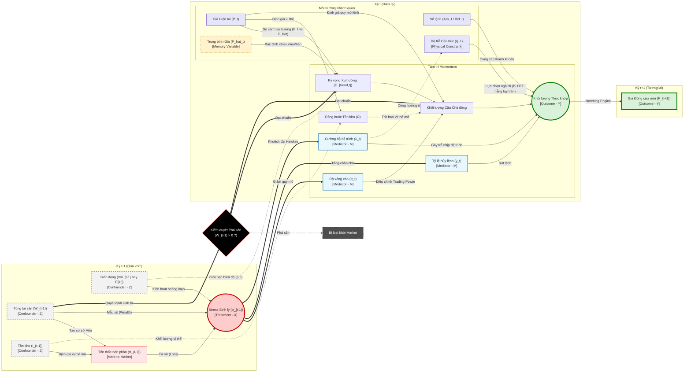

```mermaid
graph LR
    %% ==========================================
    %% THỜI ĐIỂM t-1 (QUÁ KHỨ)
    %% ==========================================
    subgraph Time_t_minus_1 ["Kỳ t-1 (Quá khứ)"]
        direction TB
        W_t1["Tổng tài sản (W_{t-1})<br/>[Confounder - Z]"]
        Inv_t1["Tồn kho (I_{t-1})<br/>[Confounder - Z]"]
        Vol_t1["Biến động (Vol_{t-1} hay E[|r|])<br/>[Confounder - Z]"]
        
        Pi_t1["Tổn thất toàn phần (π_{t-1})<br/>[Mark-to-Market]"]
        Stress_t1(("Stress Sinh lý (σ_{t-1})<br/>[Treatment - X]"))
        
        W_t1 -->|"Tạo cơ sở Vốn"| Pi_t1
        Inv_t1 -->|"Định giá vị thế mở"| Pi_t1
        Pi_t1 -->|"Tử số (Loss)"| Stress_t1
        W_t1 -->|"Mẫu số (Wealth)"| Stress_t1
        Vol_t1 -->|"Kích hoạt hoảng loạn"| Stress_t1
    end

    %% ==========================================
    %% CỔNG KIỂM DUYỆT PHÁ SẢN
    %% ==========================================
    Solvency{"Kiểm duyệt Phá sản<br/>(W_{t-1} > 0 ?)"}
    W_t1 ==>|"Quyết định sinh tử"| Solvency

    %% ==========================================
    %% THỜI ĐIỂM t (HIỆN TẠI - CƠ CHẾ VI MÔ)
    %% ==========================================
    subgraph Time_t ["Kỳ t (Hiện tại)"]
        direction TB
        
        subgraph Market_State ["Môi trường Khách quan"]
            P_t["Giá Hiện tại (P_t)"]
            P_hat["Trung bình Giá (P_hat_t)<br/>[Memory Variable]"]
            LOB_t["Sổ lệnh (Ask_t / Bid_t)"]
            Eta_L["Độ trễ Cấu trúc (η_L)<br/>[Physical Constraint]"]
        end
        
        subgraph Agent_Mind ["Tâm trí Momentum"]
            Exp_t["Kỳ vọng Xu hướng (E_{trend,t})"]
            Omega_t["Ràng buộc Tồn kho (Ω)"]
            
            Alpha_t["Độ xông xáo (α_t)<br/>[Mediator - M]"]
            Gamma_t["Tỷ lệ hủy lệnh (γ_t)<br/>[Mediator - M]"]
            Lambda_t["Cường độ đệ trình (λ_t)<br/>[Mediator - M]"]
            
            Demand_t["Khối lượng Cầu Chủ động"]
            Exec_t(("Khối lượng Thực khớp<br/>[Outcome - Y]"))
        end
        
        %% --- CƠ CHẾ ĐẶC THÙ CỦA MOMENTUM ---
        P_t -->|"So sánh xu hướng (P_t vs P_hat)"| Exp_t
        P_hat -->|"Xác định chiều mua/bán"| Exp_t
        Vol_t1 -.->|"Giới hạn biên độ (p_t)"| Exp_t
        
        %% Hội tụ tạo Ràng buộc tồn kho (Ω)
        Inv_t1 -.->|"Khối lượng vị thế"| Omega_t
        P_t -->|"Định giá vị thế"| Omega_t
        
        %% Tác động Stress
        Stress_t1 ==>|"Giảm quy mô"| Alpha_t
        Stress_t1 ==>|"Tăng chần chừ"| Gamma_t
        Stress_t1 ==>|"Khuếch đại Hawkes"| Lambda_t
        
        %% Hình thành Lực cầu
        Exp_t --> Demand_t
        P_t -->|"Định giá quy mô lệnh"| Demand_t
        Alpha_t -->|"Điều chỉnh Trading Power"| Demand_t
        Omega_t -.->|"Trừ hao Vị thế mở"| Demand_t
        
        %% Khớp lệnh & Adverse Selection
        Demand_t --> Exec_t
        LOB_t -->|"Cung cấp thanh khoản"| Exec_t
        Gamma_t -->|"Rút lệnh"| Exec_t
        Lambda_t -->|"Gây trễ nhịp đệ trình"| Exec_t
        Eta_L -->|"Lựa chọn nghịch (Bị HFT nẫng tay trên)"| Exec_t
        Lambda_t -.->|"Cộng hưởng rủi ro"| Eta_L
    end

    %% ==========================================
    %% THỜI ĐIỂM t+1 (TƯƠNG LAI)
    %% ==========================================
    subgraph Time_t_plus_1 ["Kỳ t+1 (Tương lai)"]
        direction TB
        Price_t1["Giá Đóng cửa mới (P_{t+1})<br/>[Outcome - Y]"]
        Exec_t -->|"Matching Engine"| Price_t1
    end

    %% Mở khóa Action Nodes
    Solvency == "Đạt chuẩn" ==> Exp_t
    Solvency == "Đạt chuẩn" ==> Demand_t
    Solvency -. "Phá sản" .-> Dead["Bị loại khỏi Market"]

    %% Styling
    classDef confounder fill:#f2f2f2,stroke:#808080,stroke-width:2px,stroke-dasharray: 5 5;
    classDef treatment fill:#ffcccc,stroke:#cc0000,stroke-width:4px;
    classDef mediator fill:#e6f7ff,stroke:#0066cc,stroke-width:2px;
    classDef outcome fill:#d9f2d9,stroke:#008000,stroke-width:4px;
    classDef market fill:#e6e6fa,stroke:#9370db,stroke-width:2px;
    classDef memory fill:#fff2cc,stroke:#d6b656,stroke-width:2px,stroke-dasharray: 3 3;
    classDef gate fill:#000000,stroke:#ff0000,stroke-width:2px,color:#ffffff;
    classDef dead fill:#4d4d4d,stroke:#000000,stroke-width:1px,color:#ffffff,stroke-dasharray: 2 2;
    classDef loss fill:#ffe6e6,stroke:#ff6666,stroke-width:2px;
    
    class W_t1,Inv_t1,Vol_t1 confounder;
    class Pi_t1 loss;
    class Stress_t1 treatment;
    class Alpha_t,Gamma_t,Lambda_t mediator;
    class Exec_t,Price_t1 outcome;
    class P_t,LOB_t,Eta_L market;
    class P_hat memory;
    class Solvency gate;
    class Dead dead;
```