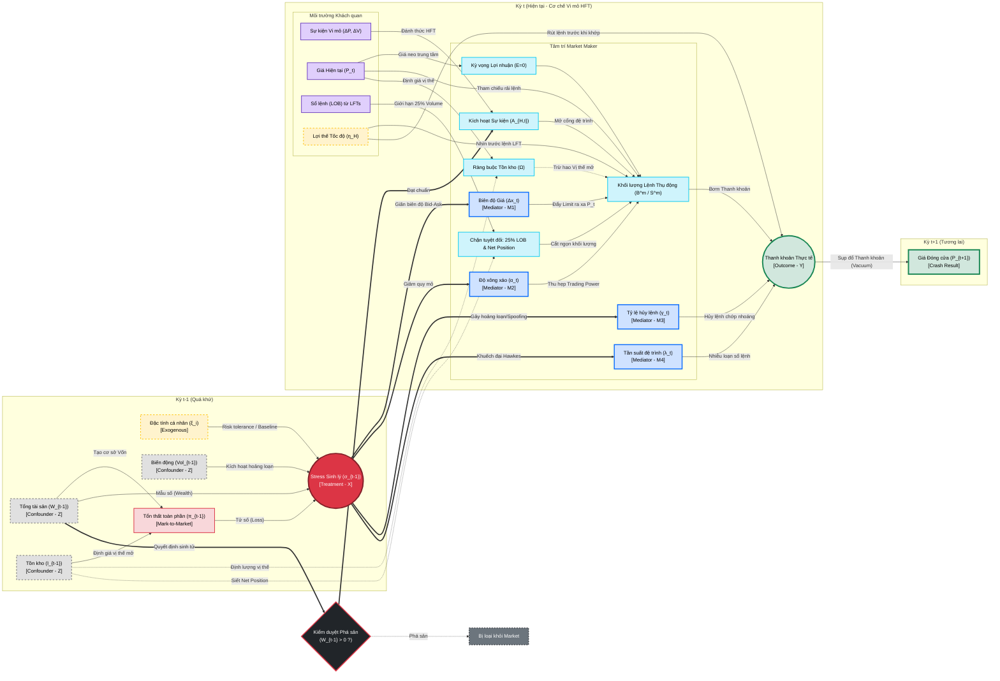

```mermaid
graph LR
    subgraph Time_t_minus_1 ["Kỳ t-1 (Quá khứ)"]
        direction TB
        Xi_i["Đặc tính cá nhân (ξ_i)<br/>[Exogenous]"]
        W_t1["Tổng tài sản (W_{t-1})<br/>[Confounder - Z]"]
        Inv_t1["Tồn kho (I_{t-1})<br/>[Confounder - Z]"]
        Vol_t1["Biến động (Vol_{t-1})<br/>[Confounder - Z]"]
        
        Pi_t1["Tổn thất toàn phần (π_{t-1})<br/>[Mark-to-Market]"]
        Stress_t1(("Stress Sinh lý (σ_{t-1})<br/>[Treatment - X]"))
        
        Xi_i -->|"Risk tolerance / Baseline"| Stress_t1
        W_t1 -->|"Tạo cơ sở Vốn"| Pi_t1
        Inv_t1 -->|"Định giá vị thế mở"| Pi_t1
        Pi_t1 -->|"Tử số (Loss)"| Stress_t1
        W_t1 -->|"Mẫu số (Wealth)"| Stress_t1
        Vol_t1 -->|"Kích hoạt hoảng loạn"| Stress_t1
    end

    Solvency{"Kiểm duyệt Phá sản<br/>(W_{t-1} > 0 ?)"}
    W_t1 ==>|"Quyết định sinh tử"| Solvency

    subgraph Time_t ["Kỳ t (Hiện tại - Cơ chế Vi mô HFT)"]
        direction TB
        subgraph Market_State ["Môi trường Khách quan"]
            Event_t["Sự kiện Vi mô (ΔP, ΔV)"]
            P_t["Giá Hiện tại (P_t)"]
            LOB_t["Sổ lệnh (LOB) từ LFTs"]
            Eta_H["Lợi thế Tốc độ (η_H)"]
        end
        
        subgraph Agent_Mind ["Tâm trí Market Maker"]
            Exp_t["Kỳ vọng Lợi nhuận (E=0)"]
            Act_t["Kích hoạt Sự kiện (A_{H,t})"]
            Omega_t["Ràng buộc Tồn kho (Ω)"]
            Limit_t["Chặn tuyệt đối: 25% LOB & Net Position"]
            
            Spread_t["Biên độ Giá (Δx_t)<br/>[Mediator - M1]"]
            Alpha_t["Độ xông xáo (α_t)<br/>[Mediator - M2]"]
            Gamma_t["Tỷ lệ hủy lệnh (γ_t)<br/>[Mediator - M3]"]
            Lambda_t["Tần suất đệ trình (λ_t)<br/>[Mediator - M4]"]
            
            Supply_t["Khối lượng Lệnh Thụ động (B^m / S^m)"]
        end
        
        Event_t -->|"Đánh thức HFT"| Act_t
        P_t -->|"Giá neo trung tâm"| Exp_t
        P_t -->|"Tham chiếu rải lệnh"| Supply_t
        
        LOB_t -->|"Giới hạn 25% Volume"| Limit_t
        Inv_t1 -.->|"Định lượng vị thế"| Omega_t
        P_t -->|"Định giá vị thế"| Omega_t
        Inv_t1 -.->|"Siết Net Position"| Limit_t
        
        Stress_t1 ==>|"Giãn biên độ Bid-Ask"| Spread_t
        Stress_t1 ==>|"Giảm quy mô"| Alpha_t
        Stress_t1 ==>|"Gây hoảng loạn/Spoofing"| Gamma_t
        Stress_t1 ==>|"Khuếch đại Hawkes"| Lambda_t
        
        Exp_t --> Supply_t
        Spread_t -->|"Đẩy Limit ra xa P_t"| Supply_t
        Alpha_t -->|"Thu hẹp Trading Power"| Supply_t
        Omega_t -.->|"Trừ hao Vị thế mở"| Supply_t
        Limit_t -->|"Cắt ngọn khối lượng"| Supply_t
        Act_t -->|"Mở cổng đệ trình"| Supply_t
        
        Supply_t -->|"Bơm Thanh khoản"| LOB_Final(("Thanh khoản Thực tế<br/>[Outcome - Y]"))
        Gamma_t -->|"Hủy lệnh chớp nhoáng"| LOB_Final
        Lambda_t -->|"Nhiễu loạn sổ lệnh"| LOB_Final
        
        Eta_H -->|"Nhìn trước lệnh LFT"| Supply_t
        Eta_H -->|"Rút lệnh trước khi khớp"| LOB_Final
    end

    subgraph Time_t_plus_1 ["Kỳ t+1 (Tương lai)"]
        direction TB
        Price_t1["Giá Đóng cửa (P_{t+1})<br/>[Crash Result]"]
        LOB_Final -->|"Sụp đổ Thanh khoản (Vacuum)"| Price_t1
    end

    Solvency == "Đạt chuẩn" ==> Act_t
    Solvency -. "Phá sản" .-> Dead["Bị loại khỏi Market"]

    %% BẢNG MÀU (COLOR DEFINITIONS)
    classDef confounder fill:#e0e0e0,stroke:#707070,stroke-width:2px,stroke-dasharray: 5 5,color:#000;
    classDef exo fill:#fff3cd,stroke:#ffc107,stroke-width:2px,stroke-dasharray: 5 5,color:#000;
    classDef loss fill:#f8d7da,stroke:#dc3545,stroke-width:2px,color:#000;
    classDef treatment fill:#dc3545,stroke:#842029,stroke-width:4px,color:#fff;
    classDef mind_calc fill:#cff4fc,stroke:#0dcaf0,stroke-width:2px,color:#000;
    classDef mediator fill:#cfe2ff,stroke:#0d6efd,stroke-width:3px,color:#000;
    classDef market fill:#e0cffc,stroke:#6f42c1,stroke-width:2px,color:#000;
    classDef outcome fill:#d1e7dd,stroke:#198754,stroke-width:4px,color:#000;
    classDef gate fill:#212529,stroke:#dc3545,stroke-width:3px,color:#fff;
    classDef dead fill:#6c757d,stroke:#212529,stroke-width:2px,color:#fff,stroke-dasharray: 4 4;
    
    %% GÁN MÀU (CLASS ASSIGNMENTS)
    class W_t1,Inv_t1,Vol_t1 confounder;
    class Xi_i,Eta_H exo;
    class Pi_t1 loss;
    class Stress_t1 treatment;
    class Spread_t,Alpha_t,Gamma_t,Lambda_t mediator;
    class Exp_t,Act_t,Omega_t,Limit_t,Supply_t mind_calc;
    class Event_t,P_t,LOB_t market;
    class LOB_Final,Price_t1 outcome;
    class Solvency gate;
    class Dead dead;
```