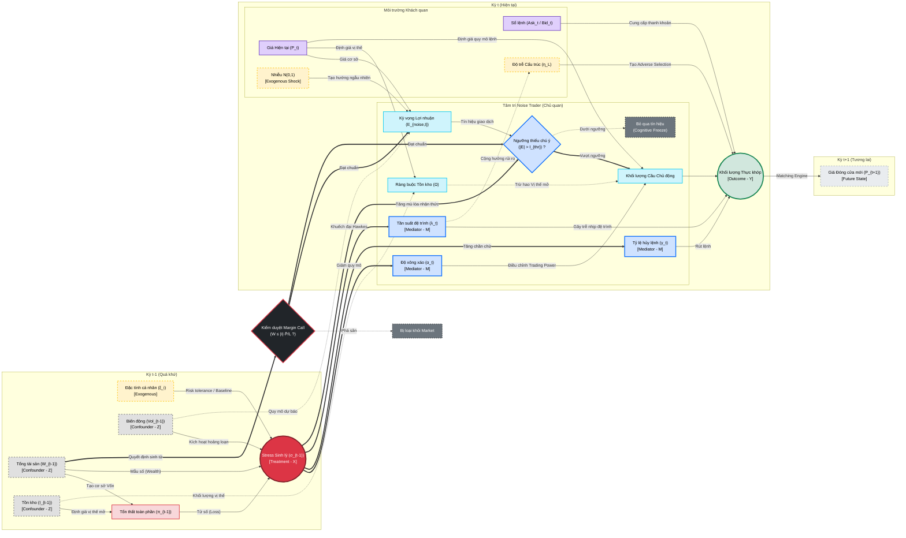

```mermaid
graph LR
    subgraph Time_t_minus_1 ["Kỳ t-1 (Quá khứ)"]
        direction TB
        Xi_i["Đặc tính cá nhân (ξ_i)<br/>[Exogenous]"]
        W_t1["Tổng tài sản (W_{t-1})<br/>[Confounder - Z]"]
        Inv_t1["Tồn kho (I_{t-1})<br/>[Confounder - Z]"]
        Vol_t1["Biến động (Vol_{t-1})<br/>[Confounder - Z]"]
        
        Pi_t1["Tổn thất toàn phần (π_{t-1})"]
        Stress_t1(("Stress Sinh lý (σ_{t-1})<br/>[Treatment - X]"))
        
        Xi_i -->|"Risk tolerance / Baseline"| Stress_t1
        W_t1 -->|"Tạo cơ sở Vốn"| Pi_t1
        Inv_t1 -->|"Định giá vị thế mở"| Pi_t1
        Pi_t1 -->|"Tử số (Loss)"| Stress_t1
        W_t1 -->|"Mẫu số (Wealth)"| Stress_t1
        Vol_t1 -->|"Kích hoạt hoảng loạn"| Stress_t1
    end

    Solvency{"Kiểm duyệt Margin Call<br/>(W ≤ |I|·P̄/L ?)"}
    W_t1 ==>|"Quyết định sinh tử"| Solvency

    subgraph Time_t ["Kỳ t (Hiện tại)"]
        direction TB
        
        subgraph Market_State ["Môi trường Khách quan"]
            P_t["Giá Hiện tại (P_t)"]
            LOB_t["Sổ lệnh (Ask_t / Bid_t)"]
            Noise_Exo["Nhiễu N(0,1)<br/>[Exogenous Shock]"]
            Eta_L["Độ trễ Cấu trúc (η_L)"]
        end
        
        subgraph Agent_Mind ["Tâm trí Noise Trader (Chủ quan)"]
            Exp_t["Kỳ vọng Lợi nhuận (E_{noise,t})"]
            Omega_t["Ràng buộc Tồn kho (Ω)"]
            
            Alpha_t["Độ xông xáo (α_t)<br/>[Mediator - M]"]
            Gamma_t["Tỷ lệ hủy lệnh (γ_t)<br/>[Mediator - M]"]
            Lambda_t["Tần suất đệ trình (λ_t)<br/>[Mediator - M]"]
            
            I_thr{"Ngưỡng thiếu chú ý<br/>(|E| > I_{thr}) ?"}
            Drop_Signal["Bỏ qua tín hiệu<br/>(Cognitive Freeze)"]
            Demand_t["Khối lượng Cầu Chủ động"]
        end
        
        %% Khối lượng Thực khớp ĐƯỢC KÉO RA NGOÀI TÂM TRÍ, NẰM TRÊN SÀN
        Exec_t(("Khối lượng Thực khớp<br/>[Outcome - Y]"))
        
        Vol_t1 -.->|"Quy mô dự báo"| Exp_t
        Noise_Exo -->|"Tạo hướng ngẫu nhiên"| Exp_t
        P_t -->|"Giá cơ sở"| Exp_t
        
        Inv_t1 -.->|"Khối lượng vị thế"| Omega_t
        P_t -->|"Định giá vị thế"| Omega_t
        
        Stress_t1 ==>|"Giảm quy mô"| Alpha_t
        Stress_t1 ==>|"Tăng chần chừ"| Gamma_t
        Stress_t1 ==>|"Khuếch đại Hawkes"| Lambda_t
        Stress_t1 ==>|"Tăng mù lòa nhận thức"| I_thr
        
        %% Cổng nhận thức xử lý BÊN TRONG Não
        Exp_t -->|"Tín hiệu giao dịch"| I_thr
        I_thr == "Vượt ngưỡng" ==> Demand_t
        I_thr -. "Dưới ngưỡng" .-> Drop_Signal
        
        Alpha_t -->|"Điều chỉnh Trading Power"| Demand_t
        P_t -->|"Định giá quy mô lệnh"| Demand_t
        Omega_t -.->|"Trừ hao Vị thế mở"| Demand_t
        
        %% Giao thoa giữa Tâm trí và Thị trường tạo ra Khớp lệnh BÊN NGOÀI
        Demand_t --> Exec_t
        LOB_t -->|"Cung cấp thanh khoản"| Exec_t
        Gamma_t -->|"Rút lệnh"| Exec_t
        Lambda_t -->|"Gây trễ nhịp đệ trình"| Exec_t
        
        Eta_L -->|"Tạo Adverse Selection"| Exec_t
        Lambda_t -.->|"Cộng hưởng rủi ro"| Eta_L
    end

    subgraph Time_t_plus_1 ["Kỳ t+1 (Tương lai)"]
        direction TB
        Price_t1["Giá Đóng cửa mới (P_{t+1})<br/>[Future State]"]
        Exec_t -->|"Matching Engine"| Price_t1
    end

    Solvency == "Đạt chuẩn" ==> Exp_t
    Solvency == "Đạt chuẩn" ==> I_thr
    Solvency -. "Phá sản" .-> Dead["Bị loại khỏi Market"]

    %% BẢNG MÀU CHUẨN (COLOR DEFINITIONS)
    classDef confounder fill:#e0e0e0,stroke:#707070,stroke-width:2px,stroke-dasharray: 5 5,color:#000;
    classDef exo fill:#fff3cd,stroke:#ffc107,stroke-width:2px,stroke-dasharray: 5 5,color:#000;
    classDef loss fill:#f8d7da,stroke:#dc3545,stroke-width:2px,color:#000;
    classDef treatment fill:#dc3545,stroke:#842029,stroke-width:4px,color:#fff;
    classDef mind_calc fill:#cff4fc,stroke:#0dcaf0,stroke-width:2px,color:#000;
    classDef mediator fill:#cfe2ff,stroke:#0d6efd,stroke-width:3px,color:#000;
    classDef market fill:#e0cffc,stroke:#6f42c1,stroke-width:2px,color:#000;
    classDef outcome fill:#d1e7dd,stroke:#198754,stroke-width:4px,color:#000;
    classDef gate fill:#212529,stroke:#dc3545,stroke-width:3px,color:#fff;
    classDef cog_gate fill:#cfe2ff,stroke:#0d6efd,stroke-width:3px,color:#000;
    classDef dead fill:#6c757d,stroke:#212529,stroke-width:2px,color:#fff,stroke-dasharray: 4 4;
    classDef future_state fill:#e9ecef,stroke:#adb5bd,stroke-width:2px,color:#000,stroke-dasharray: 5 5;
    
    %% GÁN MÀU (CLASS ASSIGNMENTS)
    class W_t1,Inv_t1,Vol_t1 confounder;
    class Xi_i,Noise_Exo,Eta_L exo;
    class Pi_t1 loss;
    class Stress_t1 treatment;
    class Alpha_t,Gamma_t,Lambda_t mediator;
    class Exp_t,Omega_t,Demand_t mind_calc;
    class I_thr cog_gate;
    class P_t,LOB_t market;
    class Exec_t outcome;
    class Price_t1 future_state;
    class Solvency gate;
    class Dead,Drop_Signal dead;
```