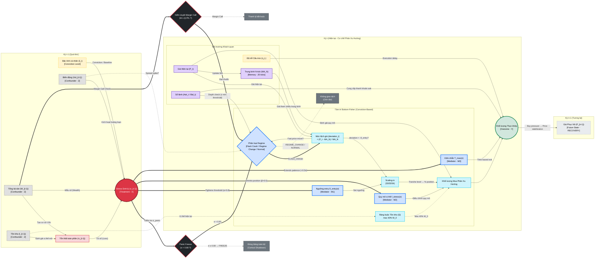

```mermaid
graph LR
    subgraph Time_t_minus_1 ["Kỳ t-1 (Quá khứ)"]
        direction TB
        Xi_i["Đặc tính cá nhân (ξ_i)<br/>[Conviction Level]"]
        W_t1["Tổng tài sản (W_{t-1})<br/>[Confounder - Z]"]
        Inv_t1["Tồn kho (I_{t-1})<br/>[Confounder - Z]"]
        Vol_t1["Biến động (Vol_{t-1})<br/>[Confounder - Z]"]
        
        Pi_t1["Tổn thất toàn phần (π_{t-1})"]
        Stress_t1(("Stress Sinh lý (σ_{t-1})<br/>[Treatment - X]"))
        
        Xi_i -->|"Conviction / Baseline"| Stress_t1
        W_t1 -->|"Tạo cơ sở Vốn"| Pi_t1
        Inv_t1 -->|"Định giá vị thế mở"| Pi_t1
        Pi_t1 -->|"Tử số (Loss)"| Stress_t1
        W_t1 -->|"Mẫu số (Wealth)"| Stress_t1
        Vol_t1 -->|"Kích hoạt hoảng loạn"| Stress_t1
    end

    Solvency{"Kiểm duyệt Margin Call<br/>(W ≤ |I|·P̄/L ?)"}
    W_t1 ==>|"Margin Call Check"| Solvency

    PanicGate{"Panic Freeze<br/>(σ > 0.80 ?)"}
    Stress_t1 ==>|"Kiểm tra σ_panic"| PanicGate

    subgraph Time_t ["Kỳ t (Hiện tại - Cơ chế Phản Xu Hướng)"]
        direction TB
        subgraph Market_State ["Môi trường Khách quan"]
            P_t["Giá Hiện tại (P_t)"]
            MA_N["Trung bình N-tick (MA_N)<br/>[Memory - 20 ticks]"]
            LOB_t["Sổ lệnh (Ask_t / Bid_t)"]
            Eta_L["Độ trễ Cấu trúc (η_L)"]
        end
        
        subgraph Agent_Mind ["Tâm trí Bottom-Fisher (Conviction-Based)"]
            RegimeClass{"Phân loại Regime<br/>[Flash Crash / Regime Change / Normal]"}
            Disloc_t["Mức lệch giá (deviation_t)<br/>= (P_t - MA_N) / MA_N"]
            Delta_entry["Ngưỡng entry δ_entry(σ)<br/>[Mediator - M1]"]
            Size_stress["Quy mô vị thế f_stress(σ)<br/>[Mediator - M2]"]
            Patience["Kiên nhẫn T_max(σ)<br/>[Mediator - M3]"]
            Tranche_t["Scaling-in<br/>(33/33/34)"]
            
            Omega_t["Ràng buộc Tồn kho (Ω)<br/>max 40% W_0"]
            Demand_t["Khối lượng Mua Phản Xu Hướng"]
        end
        
        %% Khối lượng Thực khớp
        Exec_t(("Khối lượng Thực khớp<br/>[Outcome - Y]"))
        
        %% Market observation
        P_t -->|"Giá hiện tại"| Disloc_t
        MA_N -->|"Giá tham chiếu trung bình"| Disloc_t
        P_t -->|"Update MA"| MA_N
        
        %% LOB depth check
        LOB_t -->|"Depth check (≥ min threshold)"| RegimeClass
        
        %% Regime classification inputs
        Vol_t1 -.->|"Spread spike?"| RegimeClass
        Disloc_t -->|"Fast price move?"| RegimeClass
        
        %% Stress effects on mediators
        Stress_t1 ==>|"Tightens threshold (α=0.8)"| Delta_entry
        Stress_t1 ==>|"Shrinks position (β=0.5)"| Size_stress
        Stress_t1 ==>|"Extends patience (+0.3σ)"| Patience
        
        %% Decision flow
        RegimeClass == "FLASH_CRASH" ==> Disloc_t
        RegimeClass -. "REGIME_CHANGE / NORMAL" .-> NoTrade["Không giao dịch<br/>(Chờ đợi)"]
        
        Disloc_t -->|"deviation < -δ_entry?"| Tranche_t
        Delta_entry -->|"Set ngưỡng"| Tranche_t
        
        Size_stress -->|"Điều chỉnh quy mô"| Demand_t
        Tranche_t -->|"Tranche level → % position"| Demand_t
        Omega_t -.->|"Max 40% W_0"| Demand_t
        P_t -->|"Định giá quy mô"| Demand_t
        
        Demand_t --> Exec_t
        LOB_t -->|"Cung cấp thanh khoản ask"| Exec_t
        Patience -->|"Time-based exit"| Exec_t
        Eta_L -->|"Execution delay"| Exec_t
    end

    subgraph Time_t_plus_1 ["Kỳ t+1 (Tương lai)"]
        direction TB
        Price_t1["Giá Phục hồi (P_{t+1})<br/>[Future State - RECOVERY]"]
        Exec_t -->|"Buy pressure → Price stabilization"| Price_t1
    end

    Solvency == "Đạt chuẩn" ==> RegimeClass
    Solvency -. "Margin Call" .-> Dead["Thanh lý bắt buộc"]
    
    PanicGate == "σ < 0.80" ==> RegimeClass
    PanicGate -. "σ ≥ 0.80 → FREEZE" .-> Frozen["Đóng băng toàn bộ<br/>(Cortisol Shutdown)"]

    Inv_t1 -.->|"Vị thế hiện tại"| Omega_t

    %% BẢNG MÀU CHUẨN (COLOR DEFINITIONS)
    classDef confounder fill:#e0e0e0,stroke:#707070,stroke-width:2px,stroke-dasharray: 5 5,color:#000;
    classDef exo fill:#fff3cd,stroke:#ffc107,stroke-width:2px,stroke-dasharray: 5 5,color:#000;
    classDef loss fill:#f8d7da,stroke:#dc3545,stroke-width:2px,color:#000;
    classDef treatment fill:#dc3545,stroke:#842029,stroke-width:4px,color:#fff;
    classDef mind_calc fill:#cff4fc,stroke:#0dcaf0,stroke-width:2px,color:#000;
    classDef mediator fill:#cfe2ff,stroke:#0d6efd,stroke-width:3px,color:#000;
    classDef market fill:#e0cffc,stroke:#6f42c1,stroke-width:2px,color:#000;
    classDef outcome fill:#d1e7dd,stroke:#198754,stroke-width:4px,color:#000;
    classDef gate fill:#212529,stroke:#dc3545,stroke-width:3px,color:#fff;
    classDef cog_gate fill:#cfe2ff,stroke:#0d6efd,stroke-width:3px,color:#000;
    classDef dead fill:#6c757d,stroke:#212529,stroke-width:2px,color:#fff,stroke-dasharray: 4 4;
    classDef future_state fill:#e9ecef,stroke:#adb5bd,stroke-width:2px,color:#000,stroke-dasharray: 5 5;
    classDef antigrav fill:#d4edda,stroke:#155724,stroke-width:3px,color:#000;
    
    %% GÁN MÀU (CLASS ASSIGNMENTS)
    class W_t1,Inv_t1,Vol_t1 confounder;
    class Xi_i,Eta_L exo;
    class Pi_t1 loss;
    class Stress_t1 treatment;
    class Delta_entry,Size_stress,Patience mediator;
    class Disloc_t,Omega_t,Demand_t,Tranche_t mind_calc;
    class RegimeClass cog_gate;
    class P_t,MA_N,LOB_t market;
    class Exec_t outcome;
    class Price_t1 future_state;
    class Solvency,PanicGate gate;
    class Dead,Frozen,NoTrade dead;
```
